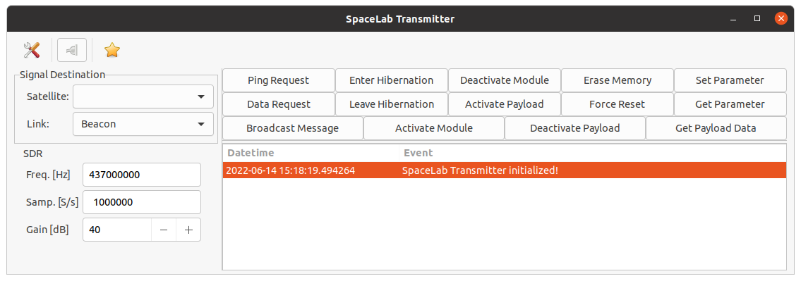

<h1 align="center">
    SPACELAB TRANSMITTER
    <br>
</h1>

<h4 align="center">Packet transmitter of the SpaceLab's satellites.</h4>

<p align="center">
    <a href="https://github.com/spacelab-ufsc/spacelab-transmitter">
        
    </a>
    <a href="https://github.com/spacelab-ufsc/spacelab-transmitter/releases">
         
    </a>
    <a href="https://github.com/spacelab-ufsc/spacelab-transmitter/blob/main/LICENSE">
        
    </a>
</p>

<p align="center">
    <a href="#overview">Overview</a> •
    <a href="#satellites">Satellites</a> •
    <a href="#dependencies">Dependencies</a> •
    <a href="#license">License</a>
</p>

# Overview

SpaceLab Packet Transmitter is a software to transmit audio records to the satellites of SpaceLab.

It is still under construction and the following information is what is expected by the final product.

Software front page screenshot:



## Satellites

This program will support the satellites below:

* FloripaSat-1 (launched in December 2019)
* GOLDS-UFSC (to be launched on 2022)
* Catarina-A1 

# Dependencies

* [PyGObject](https://pypi.org/project/PyGObject/)
* [PyNGHam](https://pypi.org/project/pyngham/)

## Installation on Ubuntu

```sudo apt install python3 python3-gi```

```pip install pyngham```

## Installation on Fedora

```sudo dnf install python3 python3-gobject```

```pip install pyngham```

## Installing

```python setup.py install```

# Documentation

## Dependencies

* Sphinx
* sphinx-redactor-theme

## Building the Documentation

```make html```

# License

This project is licensed under GPLv3 license.
