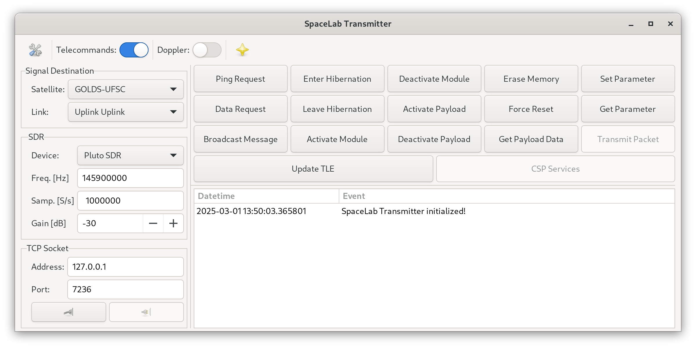

<h1 align="center">
    SPACELAB-TRANSMITTER
    <br>
</h1>

<h4 align="center">Packet transmitter of the SpaceLab's satellites.</h4>

<p align="center">
    <a href="https://github.com/spacelab-ufsc/spacelab-transmitter">
        
    </a>
    <a href="https://github.com/spacelab-ufsc/spacelab-transmitter/releases">
         
    </a>
    <a href="https://github.com/spacelab-ufsc/spacelab-transmitter/blob/main/LICENSE">
        
    </a>
</p>

<p align="center">
    <a href="#overview">Overview</a> •
    <a href="#dependencies">Dependencies</a> •
    <a href="#installing">Installing</a> •
    <a href="#documentation">Documentation</a> •
    <a href="#license">License</a>
</p>

## Overview

SpaceLab Packet Transmitter is a software to transmit audio records to the satellites of SpaceLab.

Below, there is an image of the main window of the software:



### Satellites

This program will support the satellites below:

* FloripaSat-1 (launched in December 2019)
* GOLDS-UFSC (to be launched on 2025)
* Catarina-A1
* Catarina-A2

## Dependencies

* [PyGObject](https://pypi.org/project/PyGObject/)
* [PyNGHam](https://pypi.org/project/pyngham/)
* [NumPy](https://pypi.org/project/numpy/)
* [SciPy](https://pypi.org/project/scipy/)
* [PyEphem](https://pypi.org/project/ephem/)
* [UHD](https://github.com/EttusResearch/uhd)
* [PyADI-IIO](https://github.com/analogdevicesinc/pyadi-iio)

### Installation on Ubuntu

```sudo apt install python3 python3-gi python3-numpy python3-scipy python3-ephem python3-uhd```

```pip install pyngham pyadi-iio```

### Installation on Fedora

```sudo dnf install python3 python3-gobject python3-numpy python3-scipy python3-ephem uhd uhd-devel```

```pip install pyngham pyadi-iio```

## Installing

```python setup.py install```

## Documentation

### Dependencies

* Sphinx
* sphinx-redactor-theme

### Building the Documentation

```make html```

## License

This project is licensed under GPLv3 license.
