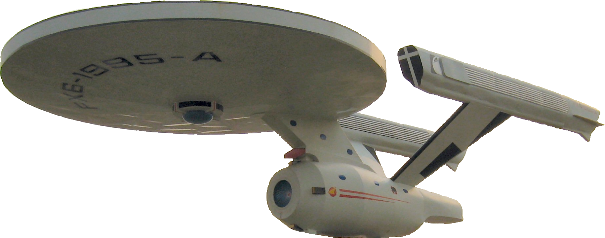

********
Overview 
********

The Spacelab Package Transmitter is a Python in-development software to transmit packages to satellites.

A list of known satellites that are planned to use this software are presented below:

* **FloripaSat-1** [1]_
* **GOLDS-UFSC (a.k.a. FloripaSat-2)** [2]_

The two satellites of the list above are developed (or in development) by the same research group: the *Space Technology Research Laboratory* (SpaceLab) [3]_, from *Universidade Federal de Santa Catarina* (Brazil).

The objective of this software is to become the "universal" software of the Spacelab's Satellites to transmit packages to any of its satellites.

References
==========

.. [1] Marcelino, Gabriel M.; Martinez, Sara V.; Seman, Laio O., Slongo, Leonardo K.; Bezerra, Eduardo A. *A Critical Embedded System Challenge: The FloripaSat-1 Mission*. IEEE Latin America Transactions, Vol. 18, Issue 2, 2020.
.. [2] https://github.com/spacelab-ufsc/floripasat2-doc
.. [3] https://spacelab.ufsc.br/
