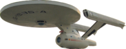

########
Overview 
########

The *Spacelab-Transmitter* is a Python in-development software to transmit telecommands to satellites using an SDR (Software Defined Radio).

A list of known satellites that are planned to use this software so far are presented below:

* **FloripaSat-1** [1]_
* **GOLDS-UFSC (a.k.a. FloripaSat-2)** [2]_
* **Catarina Constellation (Catarina-A1, A2 and A3)**
* **Persistent-1**

Most of the satellites of the list above are developed (or in development) by the same research group: the *Space Technology Research Laboratory* (SpaceLab) [3]_, from *Universidade Federal de Santa Catarina* (Brazil).

The Software
============

.. image:: img/main-window.png
   :width: 700

The objective of this software is to become the "universal" software of the Spacelab's Satellites to transmit telecommands to any of its satellites.

As it is first focused on GOLDS-UFSC, right when we run the software we can see 18 buttons with the respective telecommands of this satellite:

* Ping Request
* Enter Hibernation
* Deactivate Module
* Erase Memory
* Set Parameter
* Data Request
* Leave Hibernation
* Activate Payload
* Force Reset
* Get Parameter
* Broadcast Message
* Activate Module
* Deactivate Payload
* Get Payload Data
* Transmit Packet
* Update TLE
* Time Sync
* CSP Services

For future satellites, new types of telecommands can be added to this list.

The software also has other functionalities, like doppler correction, data export, a logging system, and others. More details are described in the next sections of this documentation.

This application is written in Python, and is based on the experience gathered in the applications developed for the FloripaSat-1 mission. For telemetry decoding, there is also another application developed by the same research group, called *SpaceLab-Decoder* [4]_.

References
==========

.. [1] Marcelino, Gabriel M.; Martinez, Sara V.; Seman, Laio O., Slongo, Leonardo K.; Bezerra, Eduardo A. *A Critical Embedded System Challenge: The FloripaSat-1 Mission*. IEEE Latin America Transactions, Vol. 18, Issue 2, 2020.
.. [2] https://github.com/spacelab-ufsc/floripasat2-doc
.. [3] https://spacelab.ufsc.br/
.. [4] https://github.com/spacelab-ufsc/spacelab-decoder
