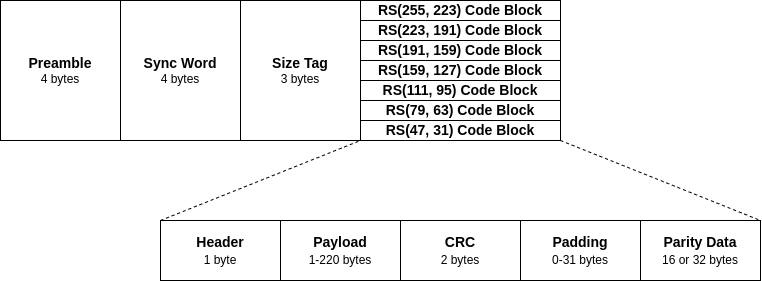
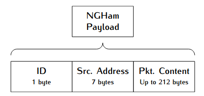

*********
Protocols
*********

The protocols used by this program can be divided in two groups: Data Link Layer and Network Layer.

Data Link Layer
===============

For the data link layer, two protocols are supported: NGHam and AX100-Mode5. Both are described below.

NGHam
-----

The NGHam protocol is a link protocol partly inspired by AX.25 [1]_, with the idea to be used in ham radio packet communication. It was developed in the context of a CubeSat development in the Norwegian University of Science and Technology (NTNU) [2]_, and is being used in a few CubeSat missions since then.

The figure below presents a diagram with packet format and the data fields of the NGHam protocol.

      Fig. Format of a NGHam packet.

AX100-Mode5
-----------

TODO

Network Layer
=============

For the network layer, two procotols are also supported: SLP and CSP.

SLP
---

The SLP (*SpaceLab Protocol*) is a simple network layer protocol, with three data fields: ID (1-byte), source address (7-bytes) and the data field. The length of the data field is limited by the capacity of the used data link protocol. The content of the data fields depends on the satellite configuration and its types of telecommands.

CSP
---

TODO

References
==========

.. [1] http://www.ax25.net/
.. [2] Løfaldli, André; Birkeland, Roger. *Implementation of a Software Defined Radio Prototype Ground Station for CubeSats*. The 4S Symposium 2016.
