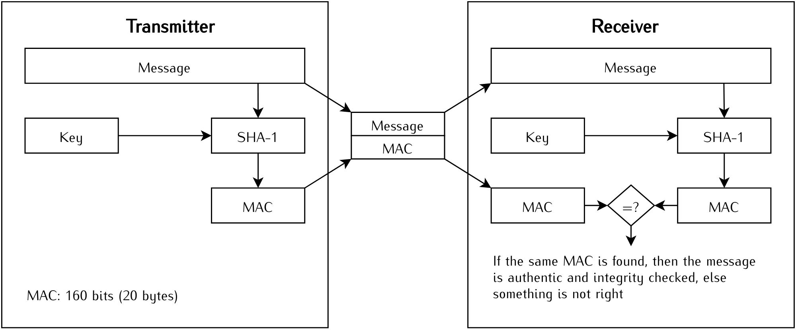
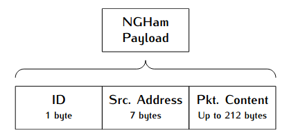

************
Telecommands
************

Introduction
============

The Spacelab-Transmitter has 14 available telecommands that interact with the lab's satellites, two of them are classified as public, that can be transmitted by any amateur radio. In the next section, these telecommands are described.

Available Telecommands
======================

The table below lists all the 14 available telecommands, including their IDs, size and type of telecommand. In the next sections, each telecommand is described.

+--------------------+-----+------------------------------------------------+--------------+---------+
| Telecommand        | ID  | Content                                        | Size (bytes) | Type    |
+====================+=====+================================================+==============+=========+
| Ping Request       | 40h | None                                           | 8            | Public  |
+--------------------+-----+------------------------------------------------+--------------+---------+
| Data Request       | 41h | Data ID + Start ts. + End ts. + Hash           | 37           | Private |
+--------------------+-----+------------------------------------------------+--------------+---------+
| Broadcast Message  | 42h | Dst. callsign + message                        | 15 to 53     | Public  |
+--------------------+-----+------------------------------------------------+--------------+---------+
| Enter Hibernation  | 43h | Hibernation in hours + Hash                    | 30           | Private |
+--------------------+-----+------------------------------------------------+--------------+---------+
| Leave Hibernation  | 44h | Hash                                           | 28           | Private |
+--------------------+-----+------------------------------------------------+--------------+---------+
| Activate Module    | 45h | Module ID + Hash                               | 29           | Private |
+--------------------+-----+------------------------------------------------+--------------+---------+
| Deactivate Module  | 46h | Module ID + Hash                               | 29           | Private |
+--------------------+-----+------------------------------------------------+--------------+---------+
| Activate Payload   | 47h | Payload ID + Hash                              | 29           | Private |
+--------------------+-----+------------------------------------------------+--------------+---------+
| Deactivate Payload | 48h | Payload ID + Hash                              | 29           | Private |
+--------------------+-----+------------------------------------------------+--------------+---------+
| Erase Memory       | 49h | Hash                                           | 28           | Private |
+--------------------+-----+------------------------------------------------+--------------+---------+
| Force Reset        | 4Ah | Hash                                           | 28           | Private |
+--------------------+-----+------------------------------------------------+--------------+---------+
| Get Payload Data   | 4Bh | Payload ID + Args. + Hash                      | 41           | Private |
+--------------------+-----+------------------------------------------------+--------------+---------+
| Set Parameter      | 4Ch | Subsystem ID + Param. ID + Param. value + Hash | 34           | Private |
+--------------------+-----+------------------------------------------------+--------------+---------+
| Get Parameter      | 4Dh | Subsystem ID + Parameter ID + Hash             | 30           | Private |
+--------------------+-----+------------------------------------------------+--------------+---------+

Ping Request
------------

The ping request telecommand is a simple command to test the communication with the satellite. When the satellite receives a ping packet, it will respond with another ping packet (with another packet ID, as defined in the downlink packets list). There are no additional parameters in the ping packet, just the packet ID and the source callsign (or address). It is also a public telecommand, anyone can send a ping request telecommand to a satellite.

Data Request
------------

TODO

Bloadcast Message
-----------------

The "broadcast message" is another public telecommand, no authentication or key is required to send this telecommand to a satellite. This command has the purpose of making a satellite transmit a custom message back to Earth. This can be useful for communication tasks, like a station sending data to another. There are two parameters in this telecommand: the destination callsign (or address), and the content of the message, which can be any sequence of ASCII characters or any byte value. There is a limit of 38 characters in the message field.

Enter Hibernation
-----------------

This telecommand activates the hibernation mode in a satellite. During the hibernation mode, no transmissions are made by the satellite, it keeps just listening for new incoming packets (reception). The satellite will stay in hibernation mode for a custom period (1 to 65536 minutes), or until a "Leave Hibernation" mode is received. This is a private telecommand, a key is required to send it. Beyond the packet ID and the source callsign (or address), the number o minutes (2 bytes long) is also transmitted.

Leave Hibernation
-----------------

This telecommand complements the "enter hibernation" telecommand by deactivating the hibernation mode in the satellite. When a satellite receives this telecommand it enables the transmission again immediatly. This is also a private telecommand, a specific key is required to send it. There is no additional content to this telecommand packet, just the packet ID and the source callsign (or address).

Activate Module
---------------

The "Activate Module" telecommand is a command to activate a internal module of the satellite. Each module has a unique ID that is passed as an argument of this telecommand's packet. The table below shows the current used IDs.

+--------------------+---------------+
| **Module**         | **ID Number** |
+====================+===============+
| Battery heater     | 1             |
+--------------------+---------------+
| Beacon             | 2             |
+--------------------+---------------+
| Periodic telemetry | 3             |
+--------------------+---------------+

This is also a private telecommand, and a key is required to transmit it.

Deactivate Module
-----------------

The "Deactivate Module" telecommand complements the telecommand above and works the same way and with the same parameters, but in this case, has the purpose of deactivating a given module of the satellite.

Activate Payload
----------------

This telecommand is similar to the telecommand "Activate Module", but in this case is used for activate payloads of the satellite. Each satellite will have a list of IDs of the set of payloads.

This is also a private telecommand and a key is required to transmit it.

Deactivate Payload
------------------

Same as the "Deativate Module" telecommand, but for payloads.

Erase Memory
------------

The telecommand "erase memory" erases all the content presented in the non-volatile memories of the onboard computer of a satellite. This is a private command, and a key is required to send it. No additional content is required in a erase memory telecommand packet, just the packet ID and the source callsign (or address).

Force Reset
-----------

This telecommand performs a general reset of the satellite. When received, the satellite reset all subsystems. This is a private telecommand, and a key is required to send this command to a satellite. There is no additional content in this packet, just the packet ID and the source callsign (or address).

Get Payload Data
----------------

TODO

Set Parameter
-------------

This telecommand allows the configuration of specific parameters of a given subsystem of the satellite. The required fields are the ID of the subsystem to set (1 byte), the ID of the parameter to set (1 byte), and the new value of the parameter (4 bytes long). The possible IDs (subsystem and parameter) vary according to the satellite. This is a private telecommand, and a key is required to send it.

Get Parameter
-------------

The telecommand "Get Parameter" complements the "Set Parameter" telecommand. It has the purpose of reading specific parameters of a given subsystem. The required fields are the subsystem's ID (1 byte) and the parameter ID (1 byte). The possible IDs (subsystem and parameter) vary according to the satellite. This is a private telecommand, and a key is required to send it.

Authentication
==============

All the telecommands classified as private use an HMAC authentication scheme. Every type of private telecommand has a unique 16-digit ASCII character key that with the telecommand sequence (or message) generates an 160-bits (20-bytes) hash sequence to be transmitted together with the packet payload. The used hash algorithm is the SHA-1. [3]_. The below illustrates this authentication method.

Structure of the packets
========================

Every package payload countains its ID (1 byte), the source callsign (source address of the ground station, 7 bytes) and the package content (data, up to 212 bytes). This last one can either have none or many parameters depending on the function of the telecommand.

The used communication protocol is a python variation of the NGHam [1]_: the PyNGHam [2]_.

References
==========

.. [1] https://github.com/skagmo/ngham
.. [2] https://github.com/mgm8/pyngham
.. [3] https://github.com/spacelab-ufsc/floripasat2-doc
