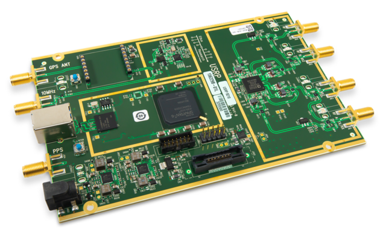
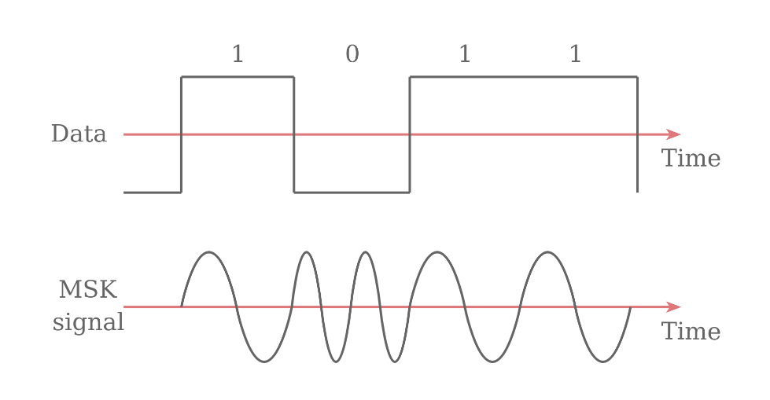
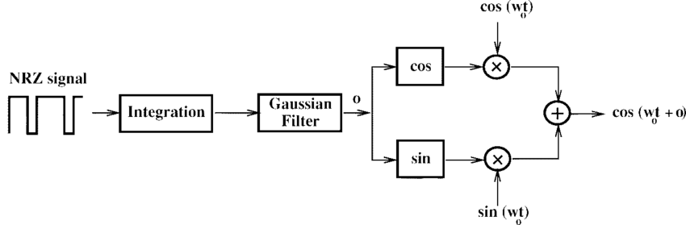

*************************
Telecommands Transmission
*************************

Introduction
============

The Spacelab-Transmitter is the software for the Spacelab's Ground Station (GRS), it can transmit 14 telecommands as previously shown in the overview.    
 
In order to not depend on another software to transmit telecommands, it was implemented a GMSK modulator in the code so that the Spacelab Transmitter works alone with the Software-Defined Radio.

The default Software-Defined Radio used in Spacelab is the USRP B210 so the code was written based in the integration with this specific SDR, and the modulation is the GMSK. In the code we have a class for USRP and for GMSK and also in every telecommand transmission function in the SpacelabTransmitter class we have implemented both of their codes.

GMSK Implementation
===================

Modulation and GMSK
*******************

In order transmit the data we need to modulate a carrier signal with the information, there are a lot of modulation schemes but the one used ins the Spacelab Trasnmitter is the GMSK, which means Gaussian Minimum Shift Keying. 

GMSK is a continuous phase scheme where there are no phase discontinuities so the carrier varies by the signal. We have a sinusoidal wave and before the modulation stage it is used a gaussian filter. In order to implement a GMSK modulator we can create a Non-Return-to-Zero (NRZ) squence, so that we have the frequency difference between the logical ones and zeros.

Image source: [1]_

**GMSK Modulation Block Diagram:** [2]_

**In the code of the GMSK class:**

The class have the following functions:

- **init**, the constructor; 
- **modulate**, which modulates an integer stream using GMSK modulation;
- **get_iq**, which computes the IQ data of the GMSK modulated signal;
- **modulate_time_domain**, which generates the GMSK modulated signal in time domain;
- **_gaussian_lpf**, which generates filter coefficients of Gaussian low pass filter (used in gmsk_mod);
- **_int_list_to_bit_list**, which converts a integer list (bytes) to a bit list.

**In the code of the telecommands transmission:**

In all telecommands functions in the SpacelabTransmitter class we have the following line:

.. code-block:: python

   mod = GMSK(0.5, 1200)

Which means that we have bit period (BT) = 0.5 and the desired data rate in 1200 bps. BT and baudrate can be configured but in the example we have GOLDS-UFSC with those values depending on the communication link.

Integration with USRP SDR
=========================

Software-Defined Radio
**********************

The IEEE considers Software defined to be refered to the use of software processing within the radio
system or device to implement operating (but not control) functions and Software-Defined Radio (SDR) a radio in which some or all of the physical layer functions are software
defined. [3]_ 

As said before,the SDR used in Spacelab transmissions to satellites is the USRP B210 and the modulation used is the GMSK. 

USRP
****

Means Universal Software Radio Peripheral, it's a family os SDRs designed by the Ettus Research and NI. The B210 has a continuous frequency coverage from 70 MHz to 6 GHz [4]_, which covers the frequencies used by the Spacelab's satellites.

USRP Integration 
****************

The USRP hardware driver (UHD) is the driver provided to the USRP radios. Since the Spacelab Transmitter code is in Python, it's necessary to install UHD and Python API and test them [5]_.

The folder has a specific file for usrp class, where it has a constructor function and the transmit function. To transmit it's necessary to have the:

- samples;
- duration;
- center frequency;
- sample rate;
- gain.

**In the code of the usrp class:**

.. code-block:: python

   samples = signal.resample_poly(samples, self._sample_rate, rate)
   if self._usrp.send_waveform(samples, dur, freq, self._sample_rate, [0], self._gain):
      return True
   else:
      return False

And the true/false return is for if it was successfull or not.

**In the code of the telecommands transmission:**

The previous parameters are set in the software and the code extracts the user inputs from the UI (GTK) to assign to the usrp values. 

.. code-block:: python

   carrier_frequency = self.entry_carrier_frequency.get_text()
 
   tx_gain = self.spinbutton_tx_gain.get_text()
 
   samples, sample_rate, duration_s = mod.modulate(pkt, 1000)
 
   sdr = USRP(int(self.entry_sample_rate.get_text()), int(tx_gain))
 
   if sdr.transmit(samples, duration_s, sample_rate, int(carrier_frequency)):

      self.write_log("Set Parameter transmitted to " + sat_json + " from" + callsign + " in " + carrier_frequency + " Hz with a gain of " + tx_gain + " dB")

   else:

      self.write_log("Error transmitting a Set Parameter telecommand!")
            
References
==========

Viswanathan, Mathuranathan. **Digital Modulations Using Python**. 1st ed., vol. 1, Independently published, 2019.

Turletti, Thierry. (1996). **GMSK in a nutshell**. 

.. [1] https://www.electronics-notes.com/articles/radio/modulation/what-is-gmsk-gaussian-minimum-shift-keying.php
.. [2] Turletti, Thierry & Bentzen, H.J. & Tennenhouse, David. (1999). Toward the software realization of a GSM base station. Selected Areas in Communications, IEEE Journal on. 17. 603 - 612. 10.1109/49.761039. 
.. [3] IEEE Project 1900.1 - Standard Definitions and Concepts for Dynamic Spectrum Access: Terminology Relating to Emerging Wireless Networks, System Functionality, and Spectrum Management https://standards.ieee.org/develop/project/1900.1.html.
.. [4] https://www.ettus.com/all-products/ub210-kit/
.. [5] https://pysdr.org/content/usrp.html
